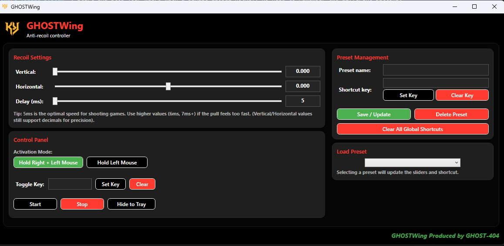

# GHOSTWing – Professional Anti-Recoil Controller

**GHOSTWing** is a high-precision, portable anti-recoil utility for Windows, designed for enthusiasts who need fine-tuned control over their mouse input. Built with .NET 10 and low-level Win32 APIs, it provides smooth, sub-pixel movement for perfect recoil compensation.

---

## 🚀 Key Features

- 🎯 **Sub-pixel Precision**: Uses fractional accumulation logic to ensure even the smallest recoil values (e.g., 0.05) result in smooth, jitter-free movement.
- 🔄 **Smart Toggle System**: Start and stop your macro with a single global hotkey. No need to remember two different buttons.
- ⏱️ **Custom Pulse Delay**: Adjust the loop speed from 5ms to 50ms. Optimize for your game's engine and your mouse's polling rate.
- 💾 **Intelligent Presets**: Create named profiles (AK-47, M4, etc.) with unique vertical, horizontal, and delay settings.
- 🎹 **Global Hotkey switching**: Assign unique keys to your presets to switch weapon profiles instantly while in-game.
- 📥 **System Tray Integration**: Minimize the app to the system tray to keep your taskbar clean while it runs in the background.
- 📦 **Portable & Self-Contained**: No installation required. Runs on any Windows 10/11 PC without needing .NET runtimes installed.

---

## 🛠️ How to Use

1. **Configure Recoil**: Adjust the **Vertical** and **Horizontal** sliders until your weapon pattern is neutralized.
2. **Set Speed**: Use the **Delay (ms)** slider to match your game's fire rate (5ms is recommended for most shooters).
3. **Save a Preset**: Give your config a name, assign a shortcut key, and click **Save / Update**.
4. **Set Toggle Key**: Assign a global "Toggle Key" to start/stop the macro instantly.
5. **Hide & Play**: Click **Hide to Tray** and enter your game. Use your Toggle Key to activate the macro when you're ready to fire.

---

## 📂 Configuration Storage
GHOSTWing follows professional Windows standards. Your settings and presets are stored in:
`%APPDATA%\GHOSTWing\`

This ensures your configurations are safe even if you move or rename the `.exe` file.

---

## 📦 Requirements & Compatibility
- **OS**: Windows 10 or Windows 11 (64-bit)
- **Runtime**: None (if using the Self-Contained build)
- **Privileges**: May require "Run as Administrator" for some games to allow mouse input injection.

---

## ⚠️ Disclaimer
**Use at your own risk.** This software utilizes low-level keyboard/mouse hooks and simulates synthetic input. 
- Using macros may be against the Terms of Service (ToS) of certain online games.
- The authors of GHOSTWing are not responsible for any bans, account restrictions, or damages resulting from the use of this tool.
- Always use responsibly in offline or training modes.

---
**Produced by GHOST-404**
