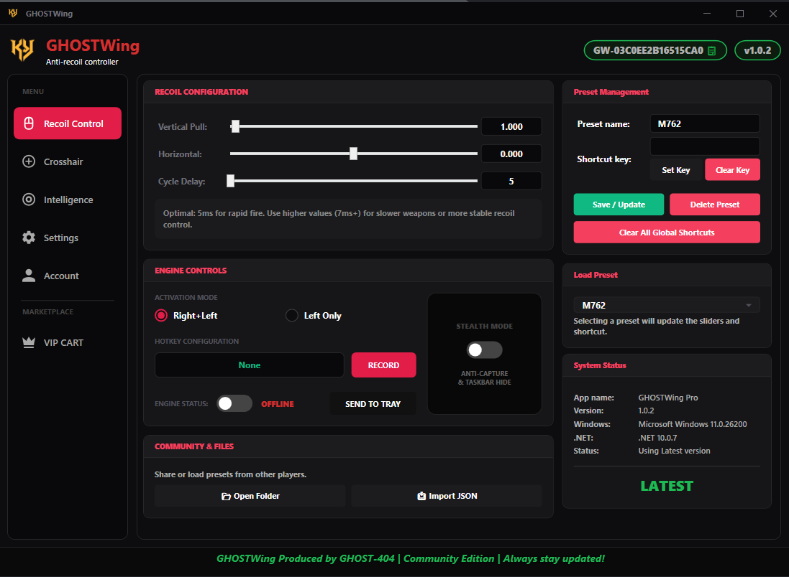
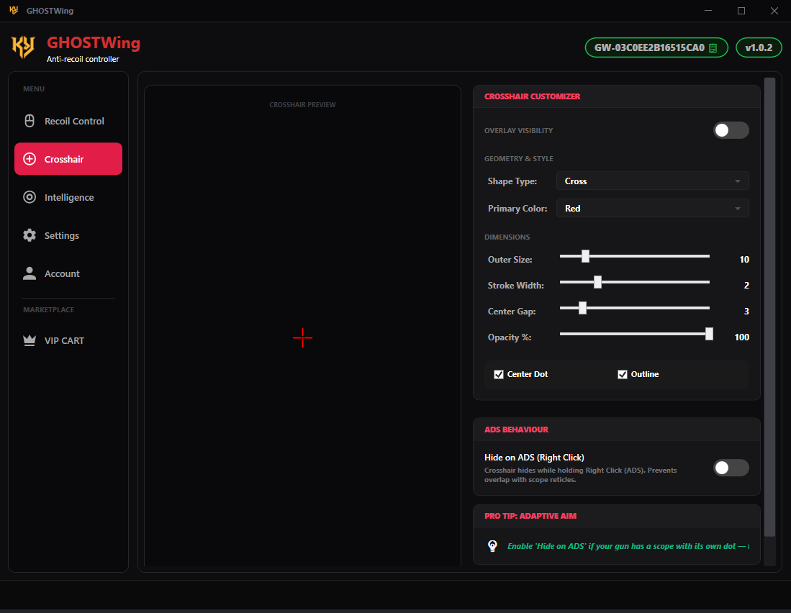
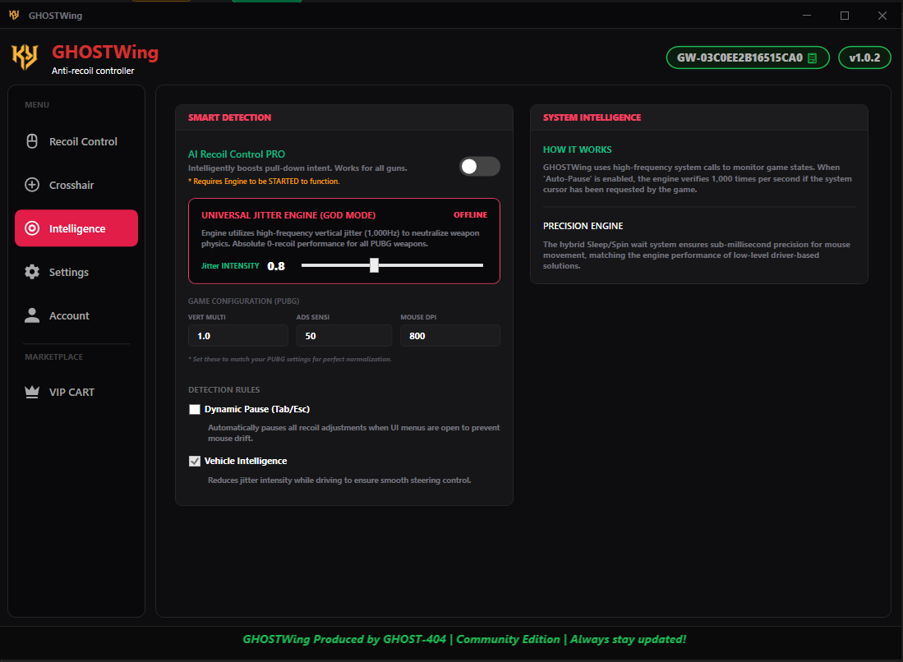
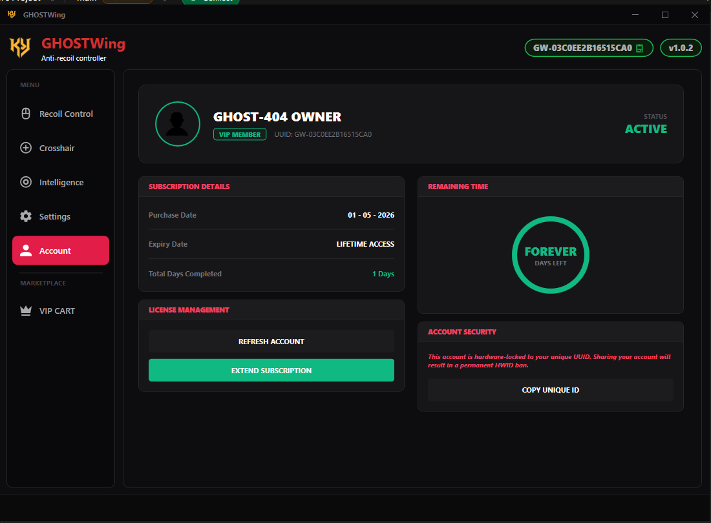

# 🦅 GHOSTWing – Professional Anti-Recoil Controller


<p align="center">
  
  
</p>
<p align="center">
  
  
</p>

**GHOSTWing** is a high-precision, industrial-grade anti-recoil utility for Windows. Designed for power users and enthusiasts, it provides low-latency, sub-pixel movement control to neutralize weapon recoil in any environment. Built with a focus on stealth and performance, GHOSTWing is the ultimate companion for precision input management.

## 🎮 Supported Games

GHOSTWing works with any game that supports raw or standard mouse input, including:

- **PUBG PC** (Highly Optimized)
- **Call of Duty** (Warzone, MW3)
- **Valorant**
- **Fortnite**
- **Apex Legends**
- **All First-Person / Third-Person Shooters**

## 🛑 Important Disclaimer & Safety

**GHOSTWing is NOT a "hack" or "cheat" in the traditional sense.**

- **Pure Automation**: It does not inject code, modify game files, or read game memory. It is a high-precision **mouse automation utility** that simulates natural input movement via standard Windows APIs.
- **Stealth First**: While it is designed to be as stealthy as possible (using Streamer Mode and low-level hooks), using any form of input automation may violate the **Terms of Service (ToS)** of certain competitive games.
- **Use Responsibly**: This software is provided "as is". The developers are not responsible for any account actions or damages resulting from its use.

## ✨ Key Features

### 🎯 High-Precision Engine

- **Sub-pixel Movement**: Uses fractional accumulation logic to handle tiny recoil adjustments (e.g., `0.01` steps) without jitter.
- **Micro-Delay Control**: Fine-tune the processing loop from **5ms to 50ms** to match your game's engine or fire rate.
- **Dual Activation Modes**: Choose between **Hold Right + Left Mouse** or **Hold Left Mouse Only** to suit your playstyle.

### 🕵️ Advanced Stealth Features (New!)

- **Streamer Mode (Content Hide)**: Automatically excludes the application window from screen capture software like **OBS, Discord, and Windows Game Bar**. Your viewers see nothing, even if the app is open on your screen.
- **Taskbar Stealth**: Completely removes the app from the Windows Taskbar. No icon, no name—total "ghost" operation.
- **System Tray Integration**: Manage the app entirely from the system tray (near the clock) for a clean workspace.

### 📂 Preset & Profile Management

- **Named Profiles**: Save unique configurations for different weapons (e.g., AK-47, M4, SMG).
- **Global Hotkeys**: Switch between weapon profiles instantly in-game using custom keyboard shortcuts.
- **Export/Import**: Share your weapon configurations with others or backup your settings via JSON files.

### 🛠️ Professional Architecture

- **Auto-Update Engine**: Checks for the latest version and community updates automatically on startup.
- **Modern UI**: Dark-themed, high-contrast interface designed for low light environments.
- **Zero Installation**: Portable executable that stores settings in `%APPDATA%\GHOSTWing` for persistence.

## 🚀 Getting Started

### Installation

GHOSTWing is portable and requires no installation.

1. Download the latest release.
2. Extract the files to a folder of your choice.
3. Run `GHOSTWing.exe`.

### Basic Usage

1. **Neutralize Recoil**: Move the **Vertical** and **Horizontal** sliders until your recoil pattern is countered.
2. **Set the Fire Rate**: Adjust the **Delay** slider (5ms-7ms is ideal for most modern shooters).
3. **Create a Profile**: Enter a weapon name (e.g., "Assault-Rifle"), set a shortcut, and click **Save / Update**.
4. **Enable Stealth**: Toggle **Streamer Mode** in the Control Panel to hide the app from your screen recordings and taskbar.
5. **Activate**: Use your global **Toggle Key** to start/stop the controller while in-game.

## 💻 Developer Information

### Tech Stack

- **Language**: C# 13 / .NET 10.0
- **Framework**: Windows Presentation Foundation (WPF)
- **APIs**: Low-level Win32 Hooks (`user32.dll`), `SetWindowDisplayAffinity` for stealth.

### Build Instructions

To build the project from source, ensure you have the .NET 10 SDK installed:

```powershell
dotnet publish -c Release -r win-x64 --self-contained true -p:PublishSingleFile=true
```

## 📂 Configuration Storage

Settings and presets are securely stored in the following directory:
`%APPDATA%\GHOSTWing\`

Files included:

- `settings.json`: Global application preferences and stealth states.
- `Presets/`: A directory containing your custom weapon JSON files.

**Produced by GHOST-404**
*Empowering precision through code.*
